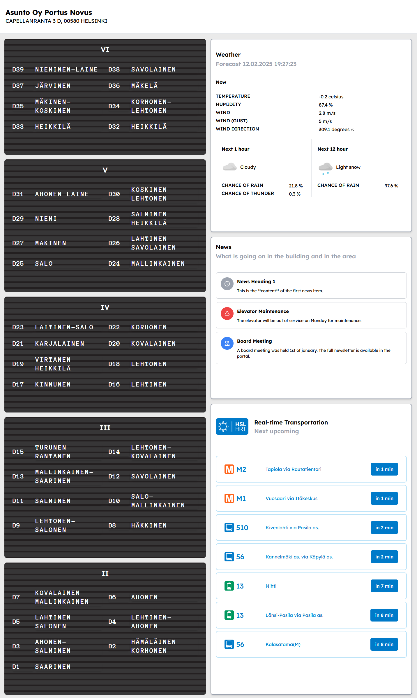

# Dashboard Proto for Housing Company

A simple dashboard prototype for a housing company. The dashboard will eventually show the current weather, news, and nearby transit data. The dashboard is built with Rust and Axum, and uses the Digitransit API for transit data, and an Weather API (TBA) for weather data. The dashboard is a work in progress and will be updated with more features in the future.

Aiming to run this on raspberry with a small screen in the lobby.

**Rust key dependencies**

askama, axum, reqwest, serde, serde_json, tokio

## Features (planned)

- List of occupants
- Nearby transit data
- News
- Weather

## Development

1. Get API Key from [Digitransit.fi](https://digitransit.fi/en/developers/)
2. Create `.env`
3. Populate it with `DIGITRANSIT_SUBSCRIPTION_KEY=your-api-key`
4. Run `cargo run`
5. [http://localhost:3000](http://localhost:3000)
