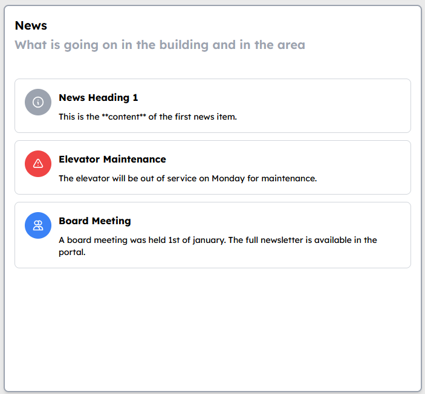
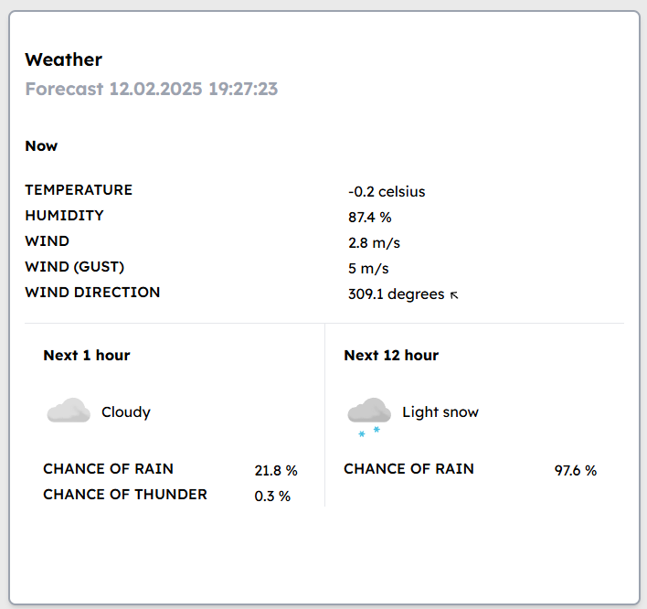
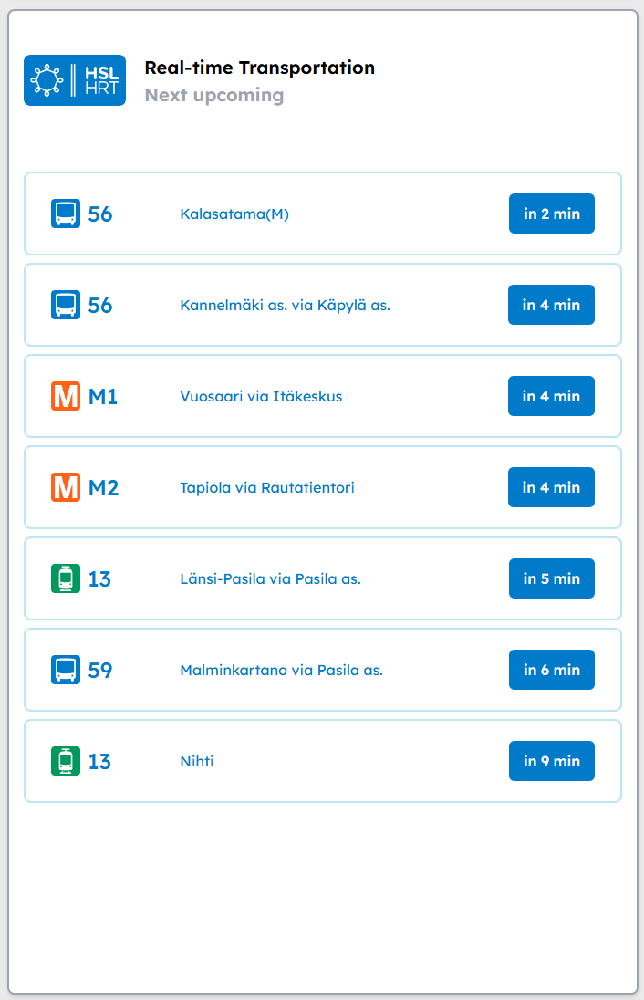

# Dashboard Proto for Housing Company

A simple dashboard prototype for a housing company. The dashboard will eventually show the current weather, news, and nearby transit data. The dashboard is built with Rust and Axum, and uses the Digitransit API for transit data, and an Weather API (yr.no) for weather data. The dashboard is a work in progress and will be updated with more features in the future.

Aiming to run this on raspberry with a small screen in the lobby.

**Rust key dependencies**

askama, axum, reqwest, serde, serde_json, tokio

## Host

`host/portus-dashboard.secrets` a file to pass the secrets during installation to be encrypted with systemd-creds encrypt
`host/setup.sh` a setup script for Debian trixie exists for setting up the host machine. 

These files should be mounted on an external usb storage device to the host machine for installation, the setup script is then also easily able to find the secrets from it.

The script elevates to root priviliges and works best if ran right after a fresh debian desktop environmentless installation and logging in.

The host setup script installs minimal wayland sway with firefox in kiosk mode and setups autologin for a kiosk user.

The script also attempts now to do some resolution & vertical orientation setup, but this needs refinement to work consistently.

## Features (planned)

- List of occupants
- Nearby transit data
- News
- Weather

### Resident data

Looking into where I could find this up-to-date.

### News

Placeholder news segment. Requires an integration to be written to some preferred news source.

### Weather from yr.no

Yr.no provides a free modern weather API that serves JSON.

- [API documentation](https://api.met.no/weatherapi/locationforecast/2.0/documentation)
- [Example request](https://api.met.no/weatherapi/locationforecast/2.0/complete?lat=60.188374&lon=24.984065)

### Transport data from Digitransit.fi

Digitransit provides a free API for transport data in Finland.

- [API documentation](https://digitransit.fi/en/developers/)

### News

TBA

## Development

1. Get API Key from [Digitransit.fi](https://digitransit.fi/en/developers/)
2. Create `.env`
3. Populate it with `DIGITRANSIT_SUBSCRIPTION_KEY=your-api-key`
4. Run `cargo run`
5. [http://localhost:3000](http://localhost:3000)
